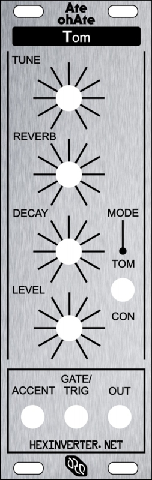
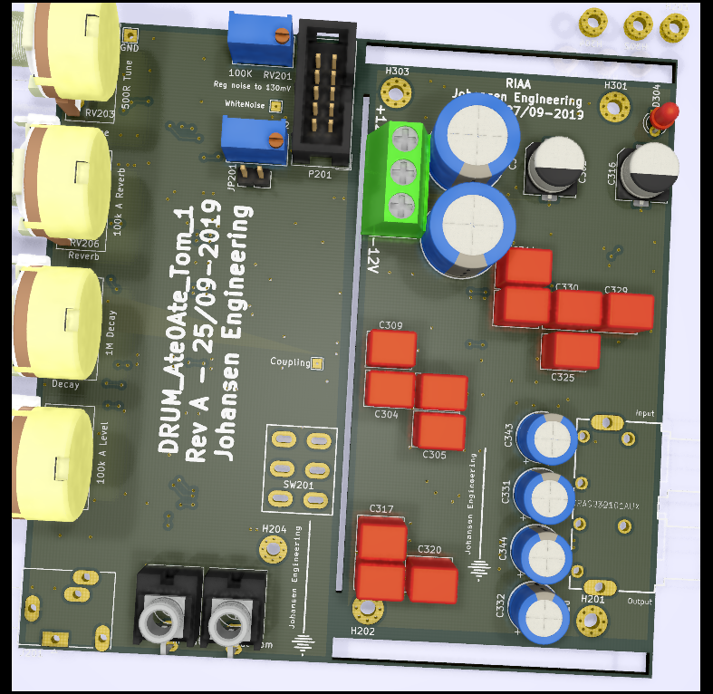
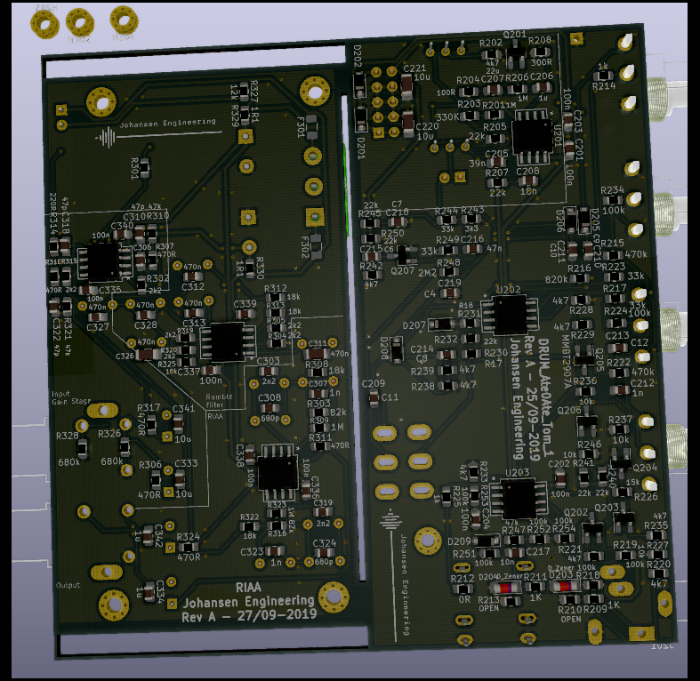
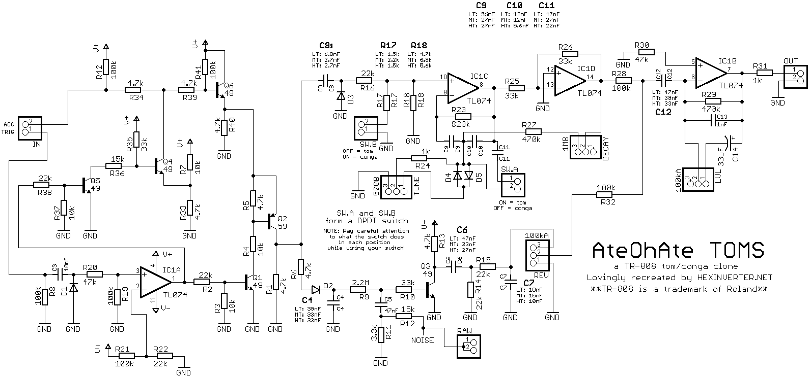
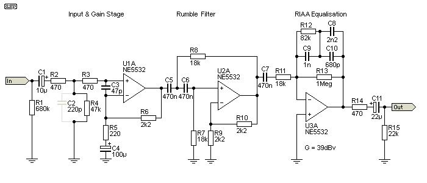

# KicadJE_Ate0Ate_Tom
Based on Hexinverter

First Drum module

First RIAA amplifier

# Purpose
1 - Match Hexinverter sch with Resynthesis panel

2 - Make a RIAA for the TD126
# Status - delivered
## Initial 
| Stage  | Detail | Status |
| ------------- | ------------- | ------------- |
| create material  | sch/pcb | OK  |
| | gerber | OK |
| production  |   | Pending |
|  | produced |  |
|  | delivered |  |

## Preliminary validation
| Test  | Detail | Status |
| ------------- | ------------- | ------------- |
| Initial Inspection | |  |
| Initial Technical Test |  | |
| Initial Product Test |  | |

## Secondary validation
| Test  | Detail | Status |
| ------------- | ------------- |------------- |
| Product Test |  | |
| Product Test |  |  |
| Quality | | |
| Quality |  |  |
| Long Term Product Test |  |  |
| Power Draw |  | 

## Errata
### Errata - Ate0Ate Tom

## Issues and Notes
### Tom
1 -

2 - 

# Pictures

# Inspiration from 
https://www.resynthesis.shop/epages/zuunneamm4zd.sf/en_GB/?ObjectPath=/Shops/zuunneamm4zd/Products/REEU-HEX-808-TM1

